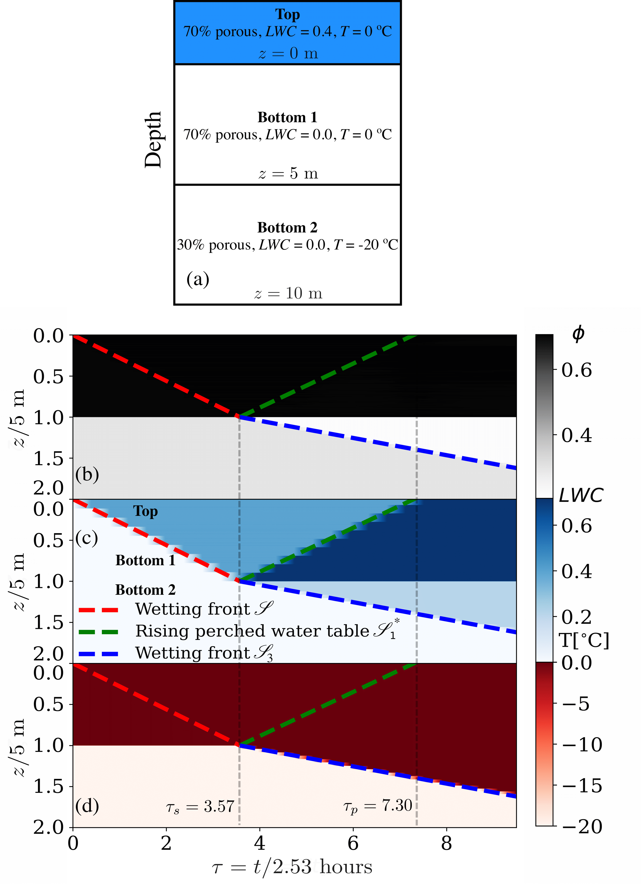

# Unified kinematic wave theory for melt infiltration into firn
## Authors
- Mohammad Afzal Shadab1,2,3 (mashadab@princeton.edu/mashadab@utexas.edu)
- Anja Rutishauser4,5
- Cyril Grima3,4
- Marc Andre Hesse1,3,4 (mhesse@jsg.utexas.edu)

## Affiliations
1 Oden Institute for Computational Engineering and Sciences, The University of Texas at Austin

2 Department of Civil and Environmental Engineering, Princeton University

3 University of Texas Institute for Geophysics   

4 Jackson School of Geosciences, The University of Texas at Austin

5 Department of Glaciology and Climate, Geological Survey of Denmark and Greenland

## Summary of contribution
Motivated by the refreezing of melt water in firn we revisit the one-dimensional percolation of liquid water and non-reactive gas in porous ice. We analyze the dynamics of infiltration in the absence of capillary forces and heat conduction to understand the coupling between advective heat and mass transport in firn. To address the dynamics of ice layer formation and to provide additional analytic solutions for the evaluation of model in firn hydrology this work makes the following contributions:

1. Formulate coupled mass and energy transport as system of non-linear hyperbolic conservation equations and analyze their coupling.
2. Use method of characteristics to develop a set of self-similar analytic solutions for problems with an initial step change in volume fractions of ice or water (Riemann problems). 
3. Apply unified kinematic wave theory to firn hydrology to describe the formation of perched aquifers and derive conditions for impermeable ice layer formation.

Figure : Infiltration into a multilayered firn with porosity and temperature decay with depth: (a) Schematic diagram showing all of the layers. The resulting evolution of firn (b) porosity φ, (c) liquid water content LWC or volume fraction of water and (d) temperature T evaluated by the numerical simulation in the absence of heat diffusion (see paper [2]). Here all dashed lines show analytic solutions computed from the unified kinematic wave theory proposed by Shadab et al. (2024) [1] in Figure 13. The thin, grey dashed lines show theoretically calculated dimensionless times of saturation and ponding. The theoretical evolutions of the initial wetting front is shown with red dashed line  and the dynamics of saturated region after wetting front reaches z = 5 m is shown by blue and green dashed lines.

## Citations/References
[1] Shadab, Rutishauser, Grima, and Hesse, 2024. A unified kinematic wave theory for melt infiltration into firn. arXiv preprint arXiv:2403.15996 (submitted).

[2] Shadab, Adhikari, Rutishauser, Grima, and Hesse, 2024. A mechanism for ice layer formation in glacial firn. Geophysical Research Letters, 51(15), p.e2024GL109893.

## Getting Started
### Dependences

The codes require the following packages to function:
- [Python](https://www.python.org/) version 3.5+
- [Numpy](http://www.numpy.org/) >= 1.16
- [scipy](https://www.scipy.org/) >=1.5
- [matplotlib](https://matplotlib.org/) >=3.3.4

Tested on
- [Python](https://www.python.org/) version 3.9.14
- [Numpy](http://www.numpy.org/) version 1.25.2
- [scipy](https://www.scipy.org/) version 1.11.2
- [matplotlib](https://matplotlib.org/) version 3.7.2

### Quick Usage
After cloning the repository and installing the required libraries, run the Python files corresponding to the figure numbers as given in the paper. Codes can be run either directly or on an IDE such as Anaconda Spyder. `PyDOT` is the folder containing the auxiliaries (except `aux`). Comments are provided in the code. All codes to run are provided in `src` folder. Output figures are located in the Figures folder. Use `%matplotlib qt` for plotting in a separate window.

#### Figures plotted by corresponding Python file in `src/` folder with rough times on a Modern 4 core PC
Figure 6-12: main.py   <Approx runtime: 1 min >

Figure   13: figure13.py   <Approx runtime: 3-4 minutes >
